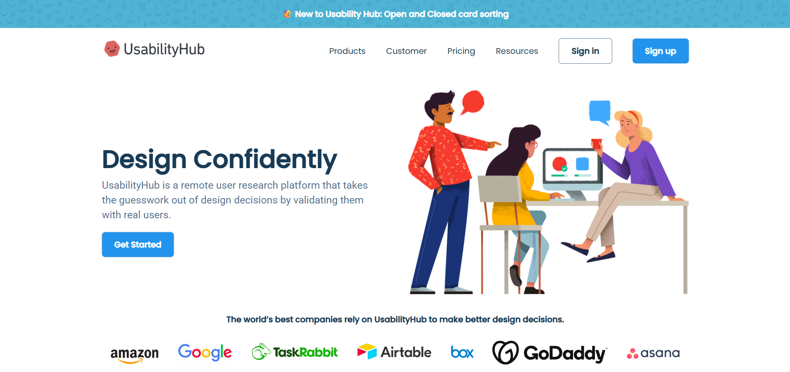

# 🚀 Usability

<div align="center">


<div style="display:flex">

[](https://github.com/Diwaker-kanojia/usability/stargazers)

[](https://github.com/Diwaker-kanojia/usability/network)

[](https://github.com/Diwaker-kanojia/usability/issues)
</div>
<b> A simple website showcasing various usability principles and design elements.</b>

[Live Demo](https://usability-sigma.vercel.app) 

</div>

## 📖 Overview

This project is a static website designed to demonstrate key principles of web usability.  It showcases different layout approaches, interactive elements, and design considerations aimed at enhancing the user experience. The site is built using HTML, CSS, and Javascript.  It serves as a learning resource and a visual example of good usability practices.

## ✨ Features

- **Clean and intuitive layout:**  Emphasizes clear navigation and information hierarchy.
- **Responsive design:** Adapts seamlessly to different screen sizes.
- **Accessible elements:**  Focuses on WCAG compliance for users with disabilities (TODO: confirm and detail specific accessibility features implemented).
- **Interactive elements:**  Includes examples of interactive components for better engagement (TODO: List specific interactive components).


## 🖥️ Screenshots



## 🛠️ Tech Stack

**Frontend:**
- 
- 
- 


## 🚀 Quick Start

This project is a static website and requires no server-side setup.

1. **Clone the repository:**
   ```bash
   git clone https://github.com/Diwaker-kanojia/usability.git
   cd usability
   ```

2. **Open `index.html` in your browser:**
    Open `index.html` directly in your web browser.


## 📁 Project Structure

```
usability/
├── asset/            # (contains all assets)
├── index.html         # Main website file
├── media.css         # CSS styles for media queries and responsiveness
└── style.css          # Main stylesheet
```

## ⚙️ Configuration

There is no external configuration required for this project as it is a static website.  All styling is contained within the `style.css` and `media.css` files.

## 🤝 Contributing

Contributions are welcome!  Please open an issue to discuss proposed changes before submitting a pull request.


---

<div align="center">

**⭐ Star this repo if you find it helpful!**

Made with ❤️ by Diwaker-Kanojia

</div>

